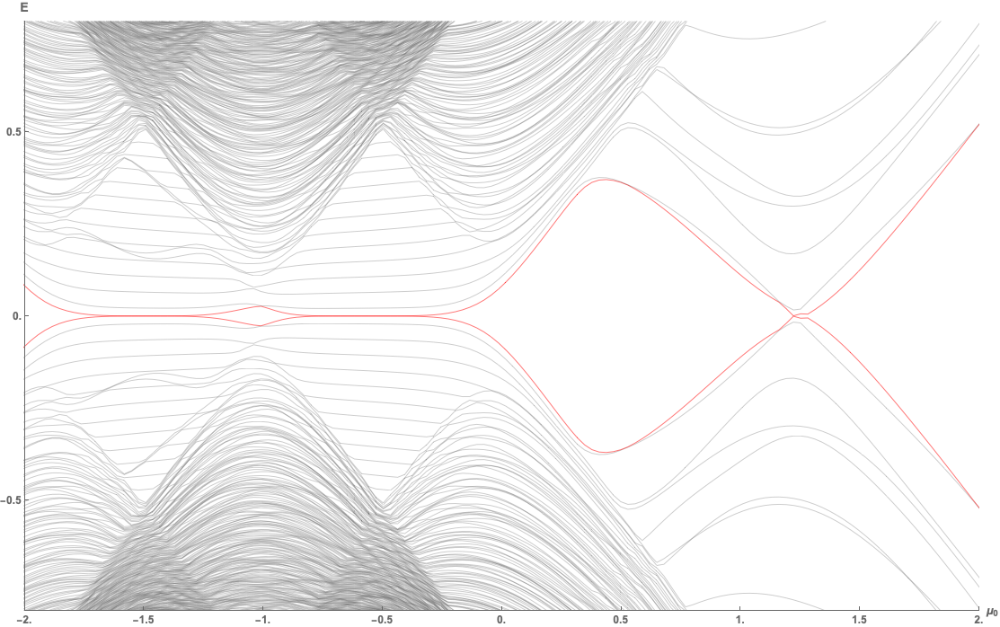
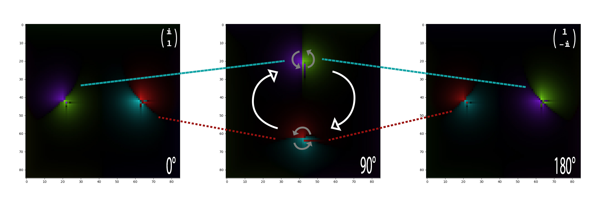
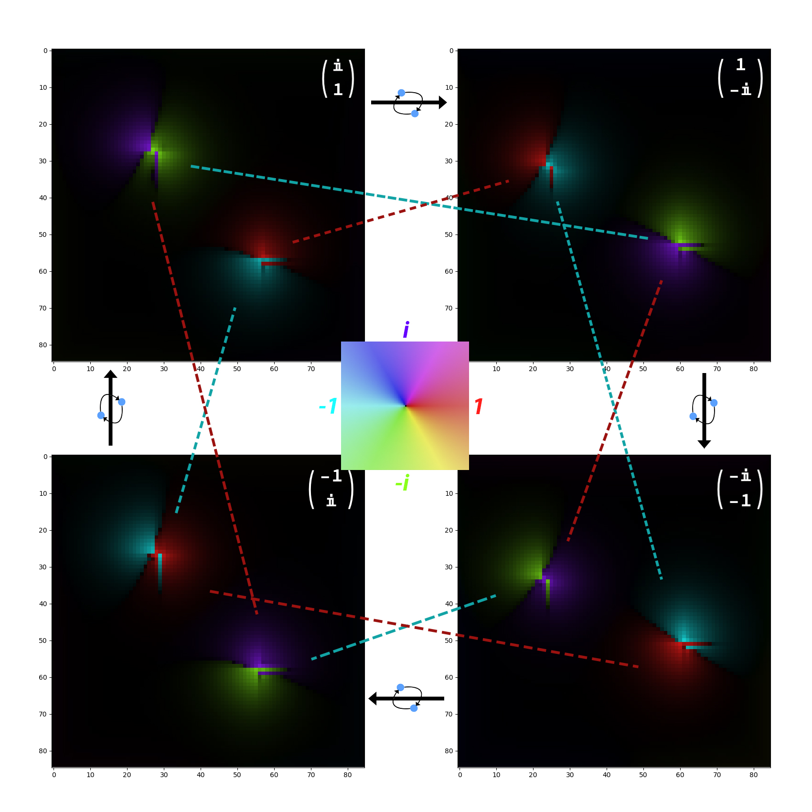
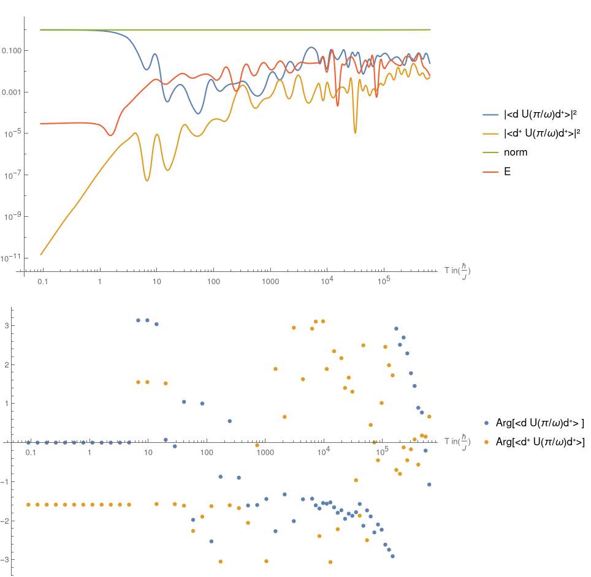
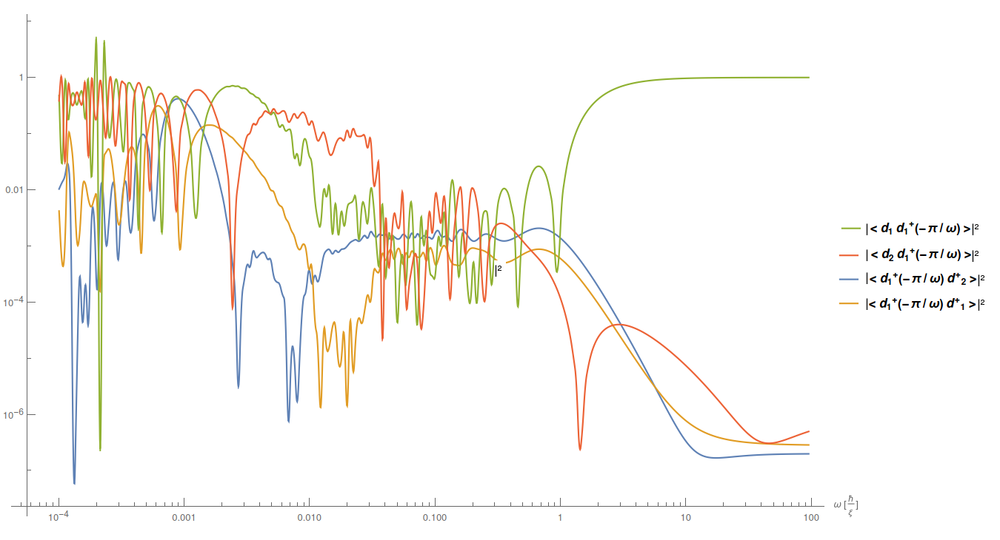
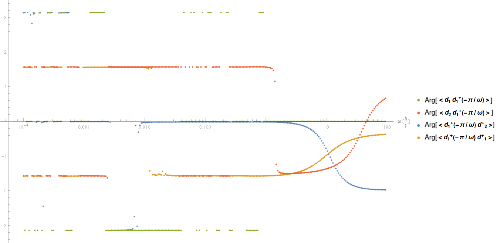

# Master Thesis — Topological Superconductors and Majorana Zero Modes
Full thesis can be found [here](/Thesis/Master.pdf)

## Jakob Teuffel

Numerical simulation and analysis of non-Abelian anyons in 2D chiral topological superconductors, with focus on adiabatic braiding of Majorana zero modes and their potential for fault-tolerant quantum computation.

## Abstract

This Master Thesis demonstrates that the non-Abelian exchange of Majorana modes in the 2D chiral topological p-wave superconductor vortices is possible with a non-zero energy splitting. The dependence of the energy splitting on the distance and radius of the vortices is shown, and a further exponential energy splitting in dependence on the distance between the vortex and the bulk edge is demonstrated. The adiabatic evolution of the quasi-particle exchange is visualised in real space. For the non-adiabatic regime, the dependence of the fidelity on the exchange speed is computed numerically for two and four vortices. The adiabatic and diabatic limits are discussed and a theoretical lower limit for the angular velocity for a non-zero energy splitting and two vortices is derived.

## Key Results

### Eigenvalue Spectrum with +4t Chemical Potential Shift



Spectrum for discrete vortices (zero energy mode highlighted in red), parameters: t=¼, Δ=1, R=Grid/8, as a function of μ₀ with a +4t shift. In this configuration only one side of the vortex is in the topological regime — the topological phase must be on the outside of the vortex for a zero-energy mode to exist. The spectrum is mirrored relative to the −4t case, with the phase transition going from chiral− to trivial instead of chiral+ to trivial.

---

### Adiabatic Exchange — Filmstrip



Complex plot of u_{x,y} + v_{x,y} for the Majorana mode γ_A at θ=0°, θ=90°, and θ=180° during a clockwise exchange. White arrows on the intermediary state indicate the rotation direction; dotted coloured lines connect identical vortices. The vortices exchange as predicted, with a global π/2 phase. The γ_A mode initially on the right (red/cyan) ends at the position of γ_B, and the colour regions shift in a way that recovers the full exchange statistic τ(σ₁⁻¹).

---

### Non-Abelian Exchange Map — All Four States



Complex plots of u_{x,y} + v_{x,y} mapping all four states reachable via repeated clockwise exchange. Moving clockwise through the four images corresponds to one additional clockwise vortex exchange each step. Dotted connecting lines indicate which vortex is which, with line colour encoding the sign picked up by the Majorana mode during exchange. The vector in the top-left shows the sign convention (i denoting the γ_B mode). Demonstrates the Z₄ periodicity of the exchange statistics.

---

### Non-Adiabatic Fidelity — Two Vortices



Propagators |⟨d d†(−π/ω)⟩|² and |⟨d†(−π/ω) d†⟩|² for the exchange of two Gaussian vortices (μ=1, Δ=1, t=−⅔, R=1/35) as a function of rotation speed ω. For ω ≫ 1 the system is diabatic (no exchange); for ω < 10⁻⁴ the adiabatic regime begins. In between, oscillatory behaviour is observed with sharp crossings where the exchange fidelity becomes large — corresponding to quasi-resonant passages through the energy gap.

---

### Non-Adiabatic Fidelity — Four Vortices





Fidelity and phase of the σ₂ exchange (exchange of two Majorana modes from *different* edge states) in the four-vortex system (μ=1, Δ=1, t=−⅔, R=1/35). The σ₂ braid group generator of B₄ mixes modes between the two edge states d₁, d₂. The adiabatic expectation values are ⟨d₁ d₁†(−π/ω)⟩ = ½, ⟨d₂ d₁†(−π/ω)⟩ = −i/2, ⟨d₁†(−π/ω) d₁†⟩ = ½, ⟨d₁†(−π/ω) d₂†⟩ = −i/2.

## Repository Structure

```text
Master-Thesis/
├── Thesis/          # LaTeX source
├── Simulation/      # C++ simulation (CMake)
├── Evaluation/      # Python analysis scripts
└── Mathematika/     # Mathematica notebooks
```

### Thesis/

LaTeX source for the written thesis. Main entry point: `Thesis/Master.tex`. Chapters cover BdG formalism, Majorana fermions, non-Abelian anyons, topological invariants, and time evolution / braiding numerics. Build output in `Thesis/build/`.

### Simulation/

C++ simulation of the 2D topological superconductor Hamiltonian. Supports:

- Eigenvalue/eigenvector diagonalization (Eigen + Accelerate/OpenBLAS on macOS, MKL on Linux)
- Adiabatic time evolution of vortex configurations
- Optional GPU acceleration via MAGMA

**Build:**

```bash
cd Simulation
mkdir -p build && cd build
cmake .. \
  -DCMAKE_BUILD_TYPE=Release \
  -DGRID=<N> \
  -DRAD=<R> \
  -DDIST=<D> \
  -DT_RES=<steps> \
  -DT_C=<chemical_potential> \
  -DT_ROT=<rotation_time> \
  -DW_START=<log_omega_start> \
  -DW_END=<log_omega_end> \
  -DW_RES=<omega_steps> \
  -DTHREADS=<mkl_threads> \
  -DTHREADSHL=<omp_threads>
make -j$(nproc)
./sim
```

Key flags: `-DTIME_EVOLUTION=TRUE` for braiding runs, `-DUSE_MAGMA=TRUE` for GPU, `-DVERBOSE=TRUE` for debug output.

Output: CSV files written to `Simulation/build/` (eigenvalue spectra, eigenvector data, fidelity decay).

### Evaluation/

Python scripts for post-processing simulation output. Scripts read CSV files from `Simulation/build/` and produce plots. Dependencies: `numpy`, `matplotlib`, `scipy`.

| Script | Purpose |
| --- | --- |
| `Eval_EigenValues.py` | Plot eigenvalue spectra |
| `Eval_EigenVectors_1D.py` | 1D eigenvector visualization |
| `Eval_EigenVectors_2D.py` | 2D eigenvector color maps |
| `Eval_EigenVectors_2D_3D-Scatter.py` | 3D scatter of 2D eigenvectors |
| `Eval_Matrix.py` | Hamiltonian matrix visualization |
| `Kitaev_Continuety.py` | Kitaev chain continuity analysis |
| `JobFactory.py` | Batch job generation for cluster |

### Mathematika/

Mathematica notebooks for analytical cross-checks (`Calcs.nb`, `Majoranaize.nb`).

## Dependencies

| Library | Purpose |
| --- | --- |
| [Eigen](https://eigen.tuxfamily.org) ≥ 3.3.9 | Linear algebra |
| Accelerate (macOS) / MKL (Linux) | BLAS/LAPACK |
| OpenBLAS (macOS) | LAPACKE C interface |
| OpenMP | Parallelism |
| Boost ≥ 1.70 | Utilities |
| MAGMA (optional) | GPU diagonalization |
